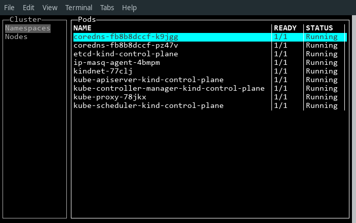

# Kube Commander



## TUI

Kube Commander UI is based on [termui](https://github.com/gizak/termui).

## Installation

The only way to install kube-commander today is through `go get`:

```bash
go get -u github.com/AnatolyRugalev/kube-commander/cmd/kube-commander
```

Make sure, your `$GOPATH/bin` path persists in `$PATH` env var. Then
launch `kube-commander`.

Have fun! 

## TODO

- [X] Configuration architecture
- [X] Basic kubernetes/client-go library integration
- [X] TUI library selection
- [X] Basic navigation implementation
- [X] Determine initial release feature set
- [X] Basic colorization and theming
- [X] Find a way to execute external processes to edit, describe etc.
- [ ] Implement features

## Feature Set

- [X] List namespaces
- [X] List pods of namespace
- [ ] List workloads of namespace (2nd level menu?)
- [X] List nodes
- [X] List PVs
- [ ] Basic resources view screen
    - [ ] Pod
    - [ ] Namespace
    - [ ] Node
    - [ ] ReplicaSet
    - [ ] Deployment
    - [ ] StatefulSet
    - [ ] PV
    - [ ] PVC
- [ ] Logs following
    - [ ] Single pod logs
    - [ ] Multiple pods logs merge?
- [X] Resource deletion with confirmation
- [ ] Resource editing with external $EDITOR
- [ ] Screen refresh
    - [X] Hotkey
    - [ ] Auto-refresh 
- [ ] Shortcuts bottom bar (eg. Midnight Commander)
- [ ] Copy to clipboard
- [ ] Charts
    - [ ] Node capacity
    - [ ] metrics-server based charts
- [ ] Mouse support
- [X] Animated preloader

## Current questions

1. How to autotest?
2. Should we support custom resources navigation?
3. **CAN WE BEAT OFFICIAL KUBERNETES DASHBOARD** in terms of features, speed and usability?
