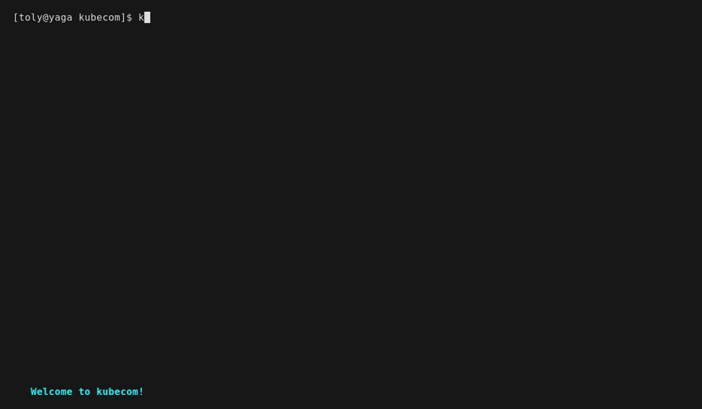

# kubecom

A fast, vim-friendly, zero-deploy Kubernetes TUI — *"the kubernetes-dashboard in
your terminal."* Browse and operate any cluster over SSH, in real time, with no
in-cluster deployment and **no `kubectl` binary required**.



> ### 🚧 `v1` is a ground-up rewrite in progress
>
> This branch (`v1`) rebuilds the 2020 codebase from scratch on a modern Go stack
> (**Bubble Tea + client-go**), fixing the old data-race/focus/redraw bug class by
> construction and dropping the hard `kubectl` dependency. The original 2020 code
> lives on [`master`](https://github.com/neuroplastio/kubecom/tree/master).
>
> **Current status:** feature-complete and dogfooded against real clusters —
> everything documented below is in the binary, not planned. What is left is the
> release itself: **no version has been tagged yet**, so you install from a `v1`
> checkout ([Install](#install)), and the Homebrew, AUR and container paths start
> working with that first tag.
>
> The rewrite is driven autonomously and documents itself in **[`vault/`](vault/)**
> (goals, plan, live task board, decision log, per-leg journal); see
> [`CLAUDE.md`](CLAUDE.md) for the operating model.

## Why kubecom

- **Zero deploy.** A single static binary you run locally or over SSH — nothing to
  install in the cluster, no HTTP ingress to expose.
- **Real-time.** Lists are server-side watched and update live; no refresh key.
- **No `kubectl` binary.** Discovery, list/watch, logs, describe, YAML, and the
  action set are all in-process via client-go.
- **Vim-first, fully rebindable.** `hjkl`, `gg`/`G`, `/`, `n`/`N` by default, with
  arrows and classic keys as an equivalent fallback — and every key is
  configurable (no hard-coded keys anywhere).
- **Approachable.** Simpler and more discoverable than k9s by design.

## What kubecom can do

Every key named below is a **default**: all of them are rebindable under `keys:`
in the config, the full list is in [`docs/keybindings.md`](docs/keybindings.md),
and `kubecom keys` prints your effective map. Two keys find the rest: `?` opens
the help overlay, and `:` opens the command palette, which lists every app-wide
verb and every action available on the selected row.

### Browsing and navigating

Run bare `kubecom` to open your current kubeconfig context. Lists are **server-side watched** — rows appear, change, and vanish live with no refresh key needed. `hjkl` (or arrows) move within a pane and switch focus between them, `gg`/`G` jump to the ends, and `Ctrl+d`/`Ctrl+u` or `Ctrl+f`/`Ctrl+b` page.

Switch resources via the command palette (`:resource`). You can type whatever you call the kind at the kubectl prompt: its plural, short name, or API group. When multiple groups define the same Kind, they are disambiguated by their group. You can hide the left menu to give the table full width.

Switch namespaces (`:namespace`) or contexts (`:context`) on the fly. Kubecom remembers the namespace and resource you last used per-context, picking up right where you left off. Switching contexts applies only to the current session.

Tables can be sorted by any visible column in either direction, or cleared to restore the server's native order. If your cluster runs metrics-server, Pods and Nodes automatically display live CPU and memory usage, which are also sortable.

To see the pods belonging to a workload (like a Deployment, StatefulSet, or Node), drill into it to open a live, filtered watch of its pods. This child table supports all the usual actions and updates live.

Mouse capture is off by default to preserve native text selection. Toggle it on to click menus, select rows, and scroll.

### Finding things

Search the open table to quickly highlight and navigate matching rows. Typing narrows the view live; matched text is highlighted. Backspacing past the start of the query cancels the search entirely. 

To search the entire cluster instead of just the open table, use the cluster search (`:search`). Matches stream in across kinds in the current namespace. Results are ranked and fuzzy-matched, and can also be narrowed using standard Kubernetes label selectors (`-l app=web`). 

For broader queries, you can widen the search to every kind your cluster exposes or to all namespaces. These toggles are temporary and reset on your next search to keep regular queries fast.

The command palette (`:`) is your single entry point for app-wide verbs and actions. It lists available commands and filters as you type. Verbs that require an argument (like picking a resource, namespace, or theme) accept it in the same input box. Every pop-up picker filters as you type.

### Inspecting objects

View an object's **describe** output in a scrollable viewer, or open its **YAML** directly in your `$EDITOR`. Kubecom suspends the UI and restores it when you quit. Saving the file applies the changes back to the cluster with full validation and conflict checking.

Open the dedicated full-screen **logs view** for any workload. It tails the last 1000 lines live. You can grep the live stream (with substring or regex matching) without pausing the tail, or pause following to explore historical lines. Logs can be wrapped, timestamped, or switched to the previous terminated container instance (`-p`). A visual selection mode lets you yank exact log lines to your system clipboard without terminal wrapping artifacts.

Secret contents are masked by default. You can reveal them in place or copy a decoded value straight to your clipboard without putting it on screen.

### Acting on objects

Open the **actions menu** to see what you can do to the selected row. It lists only the actions that apply to that kind. The object they would act on is named in the title so you know what you are targeting.

| Action | Applies to |
|--------|-----------|
| Describe | anything you can `get` |
| Logs | Pod, Deployment, ReplicaSet, StatefulSet, DaemonSet, Job, ReplicationController |
| Show pods | Deployment, ReplicaSet, StatefulSet, DaemonSet, Job, ReplicationController, Service, Node |
| Reveal secret | Secret |
| Scale | Deployment, ReplicaSet, StatefulSet, ReplicationController |
| Rollout restart | Deployment, DaemonSet, StatefulSet |
| Cordon / Uncordon / Drain | Node |
| Suspend / Resume | CronJob |
| Port-forward | Pod, Service |
| Exec shell | Pod |
| View / Edit YAML | anything you can `get` |
| Delete | anything you can `delete` |

**Exec shell** drops you into `/bin/sh` inside the container, suspending the UI exactly like the YAML editor does. If `kubectl` is installed, it leverages `kubectl exec -it` directly; otherwise, it falls back to an in-process SPDY path.

**Port-forward** asks for a local port (or picks a random one) and runs in the background. A dedicated forwards panel lets you manage and stop active forwards.

### Making it yours

- **Keys.** Every action is rebindable in `config.yaml` — there are no hard-coded keys. Run `kubecom keys` to print your effective map.
- **Themes.** Thirteen are built in (including Catppuccin, Nord, and Solarized). Kubecom sets your terminal's background to match.
- **The resource menu.** Each context can add its own custom resource types (CRDs) via a per-context YAML file.
- **Pinned kinds.** Pin any resource kind you work with frequently so it stays in the menu regardless of discovery.
- **Where you left off.** Kubecom reopens on the last namespace and resource you used per context, remembering your place across sessions.

### When something doesn't work

**A resource that won't list** says why in the table itself, not just in the toast:
open a kind whose LIST the API server refuses and the empty pane carries the reason
(RBAC denied it, credentials rejected, the CRD is gone, an unreachable conversion
webhook…), where the fix is — your machine or the cluster — and the server's own
words underneath. It stays until the list succeeds; kubecom keeps retrying in the
background, and the rows replace it the moment one comes back.

**An expired credential plugin** gets a second look. When the list fails because the
`user.exec` plugin in your kubeconfig failed (an expired AWS SSO session is the usual
one), kubecom runs that plugin once more to capture what it printed — under the UI you
would never see it — and puts its own words in the pane instead of "credentials
rejected". If it recognises the failure and your kubeconfig substantiates the fix, it
then asks whether to run it for you, naming the exact command (`aws sso login
--profile acme-prod`): accept and kubecom suspends into it in this terminal the way
`e` suspends into `$EDITOR`, then retries the request that failed; decline and nothing
runs. It never runs anything you were not asked about, and each offer is good for
exactly one run.

**Hit an error?** Every error kubecom shows you in the status bar is also written to
the log file, in full — the toast clears after five seconds and is clipped to your
terminal width, the log line is neither and carries the underlying cause. Discovery
problems go there too, including any API group that failed to load (the usual reason a
kind is missing from the menu). `tail -f ~/.cache/kubecom/kubecom.log` in a second
terminal while you reproduce, and paste what you see into the bug report.

### From the command line

```bash
kubecom                        # browse the current context, all namespaces
kubecom --context my-cluster --namespace my-ns
kubecom --kubeconfig ~/.kube/other-config -n kube-system

kubecom version                # print build information
kubecom keys                   # print the resolved keymap (defaults + your config)
```

Flags: `--kubeconfig` (path; default `$KUBECONFIG`, else `~/.kube/config`),
`--context` (default the file's current-context), `-n`/`--namespace` (default all
namespaces), `--config` (kubecom config file). A missing or invalid
kubeconfig/context fails with a clear message instead of launching. While the UI runs
it owns the terminal, so all logs (including client-go warnings) go to a file under
your cache dir (`~/.cache/kubecom/kubecom.log` on Linux), never the screen. That holds
for standard error as a whole, not just kubecom's own logging: for the life of the UI
the process's stderr *descriptor* points at that log, so anything a library prints —
an auth plugin refreshing your credentials, for instance — ends up in the file instead
of painted over the panes. The exception is the moments kubecom hands you the terminal
on purpose — the YAML editor on `e`, an exec shell, an accepted re-login — where
stderr is yours again for as long as that program runs, so it can talk to you normally.

## Install

Until the first release is tagged, build from a `v1` checkout — this needs
**Go 1.24+**, and works on Linux and macOS (Windows via WSL2):

```bash
git clone -b v1 https://github.com/neuroplastio/kubecom
cd kube-commander
go install ./cmd/kubecom      # installs kubecom to $(go env GOPATH)/bin
```

Release archives, the container image, Homebrew and the AUR package are all wired
and start working with that first tag. [`docs/install.md`](docs/install.md) has
every path, including why `go install …@v1` cannot work and what changes for a
returning 2020 kube-commander user.

## Configuration

kubecom needs no configuration. When you want some, it reads
`~/.config/kubecom/config.yaml`:

```yaml
theme: monokai
keys:
  nav.down: ["j", "down"]
  nav.up:   ["k", "up"]
```

[`docs/configuration.md`](docs/configuration.md) covers the config file, the
built-in themes, per-context resource menus, pinned kinds, what kubecom remembers
per context, and migrating a config from the 2020 kube-commander.
[`docs/keybindings.md`](docs/keybindings.md) is the generated key reference.

## Contributing

The rewrite is currently driven autonomously against the plan in
[`vault/`](vault/). If you'd like to contribute, please open an issue describing
your intent first so we can align with the milestone plan.

## Special thanks

- [Bubble Tea / Bubbles / Lipgloss](https://github.com/charmbracelet) — the TUI stack
- [client-go](https://github.com/kubernetes/client-go) — in-process Kubernetes access
- [k9s](https://github.com/derailed/k9s) — a contemporary Kubernetes TUI in the same space
